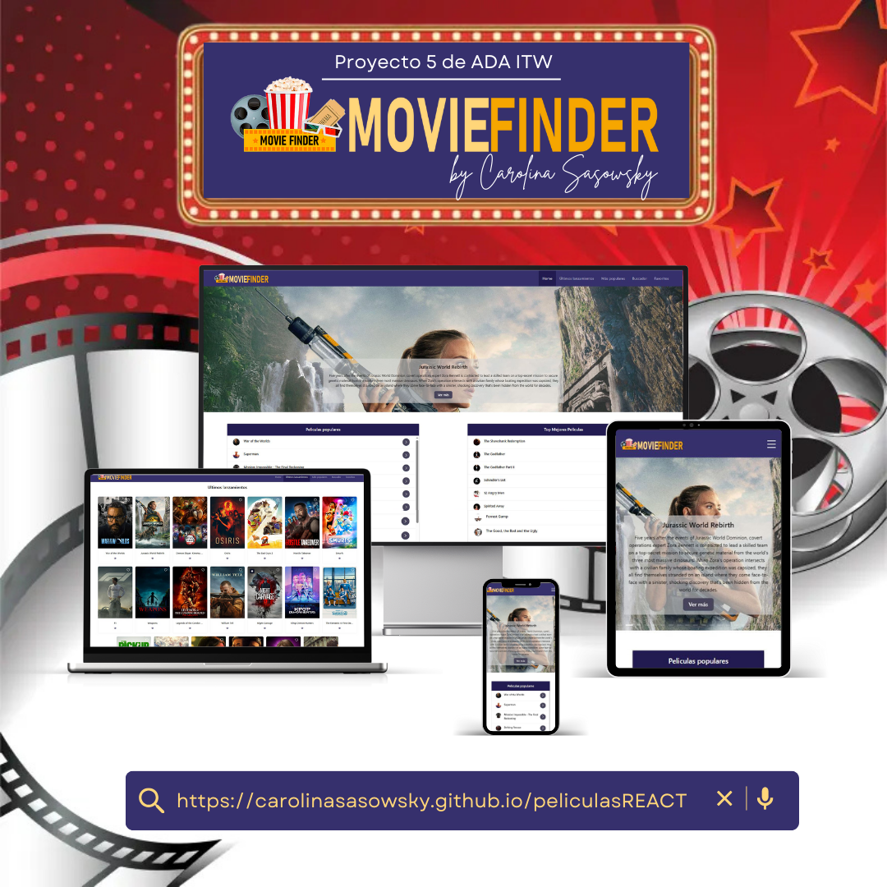

  

### 
 Desarrolladora Frontend | Mgter. en Diseño Editorial  Diseñadora Gráfica 

________________________________

## 🌟 Proyecto 4 - ADA ITW: Buscador de Películas

Este proyecto consiste en desarrollar una **aplicación web en React** que permite a los usuarios explorar películas a través de diferentes secciones: estrenos, populares y mejor puntuadas. La aplicación se conecta a una **API de películas** y permite manipular la información de manera dinámica, aplicando conceptos de React como componentes reutilizables, hooks y contexto global.  

El proyecto se desarrolló siguiendo prácticas profesionales de trabajo en equipo, utilizando ramas específicas para cada funcionalidad y aplicando **Pull Requests (PRs)** para integrar los cambios a la rama principal.

Fue desarrollada como trabajo final del **Módulo 6 de React** del programa **Desarrollo Web Frontend** de **ADA ITW**.

________________________________

## 🌐 Ver la aplicación en funcionamiento

👉 [Explorar la interfaz desplegada](https://carolinasasowsky.github.io/peliculasREACT/)

________________________________

## 🖥️ Vista general del diseño

La aplicación cuenta con un **diseño moderno y responsivo**, adaptado a distintos tamaños de pantalla. Se respetan las interacciones y el flujo de navegación entre las distintas secciones, asegurando que la experiencia del usuario sea fluida y coherente.

  

Se incorporan elementos visuales como sliders, tarjetas de películas y botones de acción para mejorar la interacción y la estética general.

  

________________________________

## 🛠️ Tecnologías utilizadas

- **React**: Biblioteca principal para la construcción de la interfaz.  
- **Axios**: Para realizar solicitudes a la API de películas.  
- **React Router**: Para gestionar la navegación entre vistas.  
- **React Context & Custom Hooks**: Para el manejo de estado global y lógica reutilizable.  
- **Sass**: Preprocesador CSS para modularidad y reutilización de estilos.  
- **Ant Design**: Librería de componentes UI para una experiencia visual consistente.  
- **React Icons**: Conjunto de iconos integrados en React.  
- **Swal (SweetAlert2)**: Alertas y pop-ups interactivos.  
- **LocalStorage**: Persistencia de películas favoritas.  

________________________________

## 🎨 Diseño y experiencia de usuario

El diseño se centra en la **claridad y facilidad de uso**, con un menú principal que permite navegar entre las secciones: Home, Últimos Lanzamientos, Populares y Buscador.  

Se priorizó una **experiencia fluida**, evitando recargas de página y asegurando que todas las vistas sean accesibles y responsivas. Cada interacción, como agregar favoritos o visualizar detalles, se realiza de manera intuitiva.

________________________________

## 🔍 Funcionalidades principales

La aplicación incluye varias funcionalidades clave que permiten a los usuarios interactuar con las películas de manera completa:

### 🔹 Búsqueda
- Input dinámico que filtra películas según el texto ingresado.  
- Se muestran hasta 20 resultados que coincidan con la búsqueda.  
- La URL se actualiza automáticamente para reflejar la búsqueda realizada.

### 🔹 Visualización detallada de la película
- Vista con **poster, fondo de pantalla y descripción completa**.  
- Botón para reproducir el tráiler de la película (funcionalidad avanzada).  
- Acceso desde cualquier lista de películas mediante un clic en la tarjeta.  

### 🔹 Previsualización del tráiler
- Integración de reproductor para trailers.  
- Funcionalidad opcional pero disponible para mejorar la interacción.  
- Permite reproducir el tráiler sin salir de la vista de detalles.

________________________________

## 🧩 Funcionalidades secundarias

- **Agregar a favoritos**: Los usuarios pueden marcar películas como favoritas y estas se almacenan en _ **LocalStorage** para persistencia entre sesiones.  
- **Slider en Home**: Muestra al menos 20 películas recomendadas con una breve descripción.  
- Listas de Populares y Mejor puntuadas: Muestra 10 películas por lista.  
- Paginador en Últimos Lanzamientos y Populares: Permite navegar entre películas de 20 en 20.  
- Footer en todas las vistas: Contiene información adicional y navegación secundaria. 

________________________________

## 📂 Objetivo del proyecto

- **Aplicar los conceptos de React** aprendidos durante el curso, incluyendo **useState, useEffect, hooks personalizados y contexto**.  
- **Desarrollar una aplicación funcional y responsiva**, conectada a una API de películas.  
- **Fomentar buenas prácticas de trabajo en ramas**, y realizando merges mediante PRs.  
- **Implementar funcionalidades avanzadas** como previsualización de trailers, actualización dinámica de URL y persistencia de favoritos.  
- **Mejorar la experiencia del usuario**, asegurando fluidez en la navegación y coherencia visual en todas las secciones.

Este proyecto forma parte de mi [**Portafolio Personal**](https://carolinasasowsky.github.io/proyecto-portafolio/), con el objetivo de mostrar el nivel de desarrollo técnico y creativo alcanzado durante el proceso de formación.
